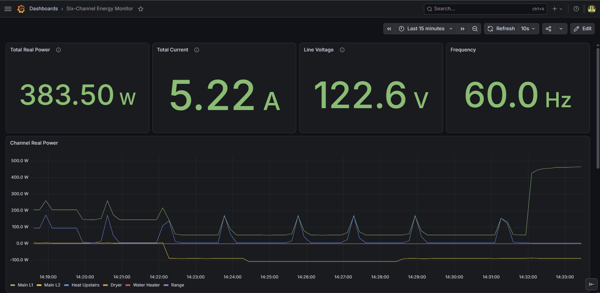
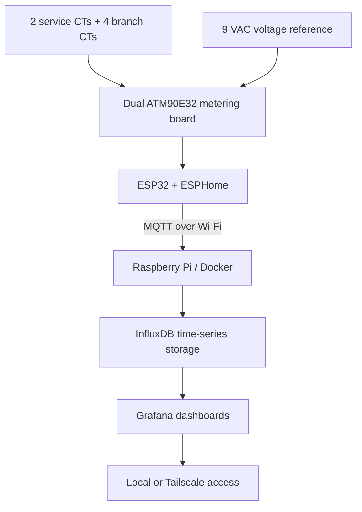
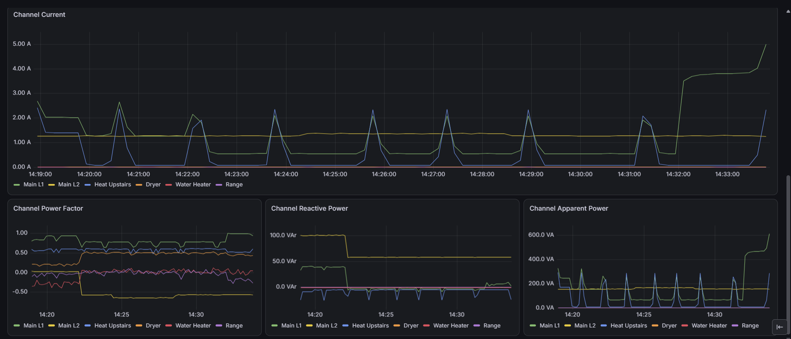
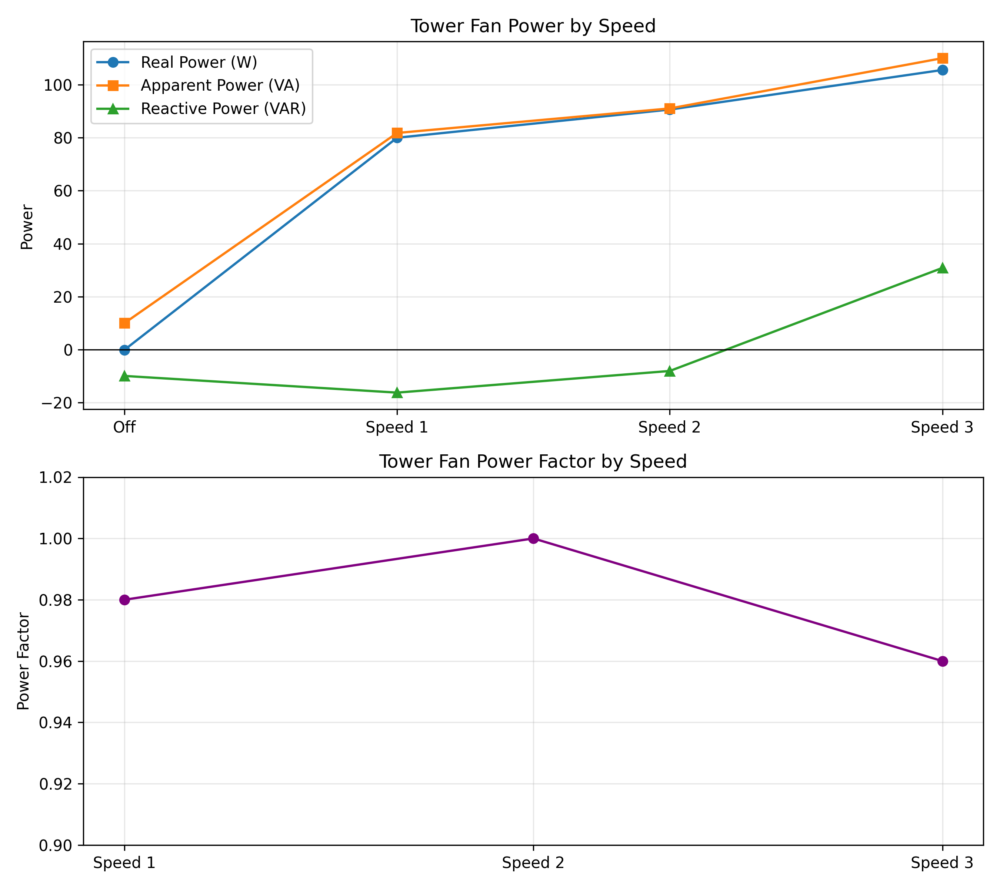
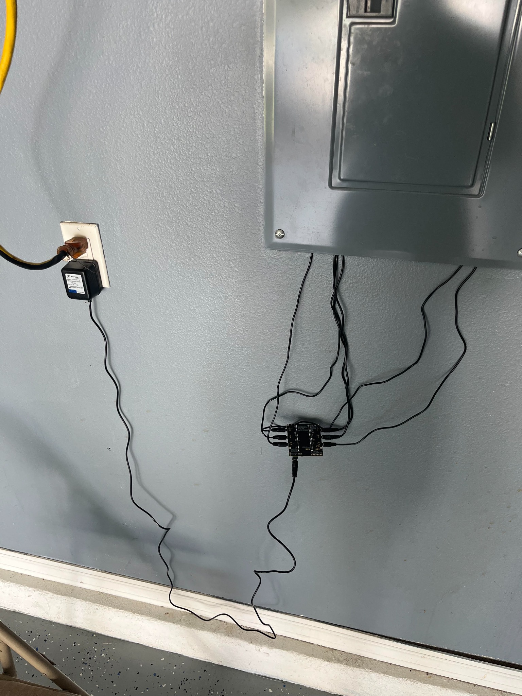

# Six-Channel Whole-Home Energy Monitor

An end-to-end residential energy-monitoring system built around an ESP32 and a dual-ATM90E32 six-channel metering board. The completed system is installed at the electrical panel, records circuit telemetry continuously, stores time-series data on a Raspberry Pi, and exposes a remotely accessible Grafana dashboard.



*Live dashboard view: 383.5 W, 5.22 A, 122.6 V, and 60.0 Hz with per-channel power history.*

## What I built

- Installed two split-core CTs on the incoming 120/240 V service conductors and four CTs on selected branch circuits
- Measured RMS current and voltage, real/reactive/apparent power, power factor, frequency, and energy
- Calibrated voltage and each CT family against handheld reference instruments
- Published ESP32 telemetry over MQTT every 10 seconds
- Hosted MQTT ingestion, InfluxDB, and Grafana continuously on a Raspberry Pi using Docker
- Built a dashboard for per-channel measurements, whole-home power, and historical trends
- Added secure remote dashboard access with Tailscale
- Demonstrated remote ESPHome OTA updates by tunneling through the Raspberry Pi

## System architecture



See [Architecture](docs/architecture.md) for the data path and design decisions.

## Live telemetry

The dashboard separates the two service legs from the monitored upstairs heat, dryer, water-heater, and range circuits. In addition to current and real power, the lower panels expose power factor, reactive power, and apparent power for load-behavior analysis.



The screenshot captures real household transitions at a 10-second refresh interval, including recurring upstairs-heat demand and a larger Main L1 step near the end of the window.

## Hardware

| Component | Function |
|---|---|
| ESP32 DevKitC | Firmware host, networking, MQTT, and OTA |
| CircuitSetup six-channel board | Two ATM90E32 metering ICs and CT interfaces |
| 2× SCT-016, 120 A/40 mA | Main service conductors (CT1 and CT2) |
| 4× SCT-013-000, 100 A/50 mA | Selected branch circuits (CT3 through CT6) |
| 9 VAC AC-AC adapter | Isolated line-voltage waveform reference |
| Raspberry Pi | Always-on Docker host for the monitoring stack |
| Clamp meter and multimeter | Calibration references |

## Software stack

| Layer | Technology |
|---|---|
| Embedded firmware | ESPHome |
| Metering interface | ATM90E32 over SPI |
| Telemetry transport | MQTT |
| Ingestion | Telegraf |
| Time-series database | InfluxDB |
| Visualization | Grafana |
| Deployment | Docker on Raspberry Pi |
| Remote access | Tailscale |

## Calibration results

### Branch-circuit CTs

The SCT-013-000 gain was calibrated with a tower fan at three steady operating points. The gain changed from `27518` to `28646`.

| Fan setting | Clamp meter | Before calibration | Initial error |
|---|---:|---:|---:|
| Speed 1 | 0.660 A | 0.630 A | -4.5% |
| Speed 2 | 0.740 A | 0.710 A | -4.1% |
| Speed 3 | 0.885 A | 0.855 A | -3.4% |

After calibration, the monitor matched the clamp meter at the displayed 0.01 A resolution across the three test points.

### Main-service CTs

The two SCT-016 sensors were calibrated individually after installation under higher household loads.

| Channel | Monitor before correction | Clamp reference | Final gain |
|---|---:|---:|---:|
| CT1 trial 1 | 18.37 A | 27.49 A | `62250` |
| CT1 trial 2 | 23.40 A | 34.69 A | `62250` |
| CT2 | 4.78 A | 6.76 A | `59095` |

### Voltage

The voltage gain changed from `7305` to `6921`, correcting the monitor from 129.3 V to approximately 122.6–122.7 V against a 122.5 V reference.

The full method and calculations are in [Calibration](docs/calibration.md). Raw tower-fan samples and the processed CSV are retained in [`data/`](data/).



## Final system status

As of August 2026, the monitor is:

- physically installed and operating continuously
- reporting all six channels with correct CT polarity
- storing measurements in InfluxDB
- displaying live and historical data in Grafana
- accessible remotely through a private Tailscale network
- remotely updateable through an SSH tunnel to the Raspberry Pi

## Physical commissioning

The photo below documents the exterior commissioning configuration: six CT leads exit the panel and connect to the ESP32/ATM90E32 assembly while the isolated 9 VAC reference is powered from the adjacent receptacle. The exposed-board arrangement shown here was used for commissioning and validation; a covered enclosure and secured cable routing are the appropriate final mechanical configuration.



## Repository contents

| Path | Contents |
|---|---|
| [`energy_meter.yaml`](energy_meter.yaml) | Sanitized active ESPHome configuration |
| [`secrets.example.yaml`](secrets.example.yaml) | Credential template; no real secrets |
| [`docs/architecture.md`](docs/architecture.md) | System and data-flow design |
| [`docs/calibration.md`](docs/calibration.md) | Reference measurements and gain calculations |
| [`docs/installation.md`](docs/installation.md) | Installation design and safety boundaries |
| [`docs/backend.md`](docs/backend.md) | Raspberry Pi, Docker, data, and remote access overview |
| [`build-log.md`](build-log.md) | Chronological engineering build log |
| [`data/`](data/) | Bench-test source data and analysis script |

## Reproducing the firmware configuration

1. Install ESPHome.
2. Copy `secrets.example.yaml` to `secrets.yaml`.
3. Replace every placeholder locally. `secrets.yaml` is intentionally ignored by Git.
4. Validate the configuration:

   ```bash
   esphome config energy_meter.yaml
   ```

5. Compile and upload only after adapting the calibration constants, network settings, and channel assignments to the target hardware.

## Safety

This repository documents a personal engineering project; it is not an installation guide for energized electrical equipment. Service conductors can remain energized even when the main breaker is open. Work in or around a panel should be performed only by a qualified person using applicable codes, permits, protective equipment, and manufacturer instructions. Split-core CT secondaries must never be left open while clamped around an energized conductor unless the CT is specifically designed to be safe in that condition.

## Author

Daniel Joseph - Electrical Engineering student, University of Florida
