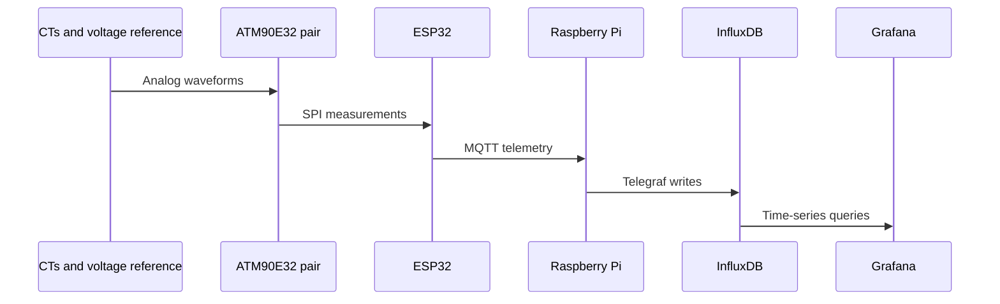

# Architecture

## Measurement path

Each split-core current transformer produces a scaled waveform proportional to conductor current. A 9 VAC adapter provides an isolated representation of line voltage. Two ATM90E32 metering ICs sample these signals and calculate RMS current, RMS voltage, real power, reactive power, apparent power, power factor, and frequency.

The ESP32 communicates with both metering ICs over SPI. ESPHome exposes local diagnostics and publishes measurements to MQTT at a 10-second interval.

## Data path

## Channel model

| Channel | Sensor | Role | Metering IC |
|---|---|---|---|
| CT1 | SCT-016 120 A/40 mA | Main service L1 | IC1, phase A |
| CT2 | SCT-016 120 A/40 mA | Main service L2 | IC1, phase B |
| CT3 | SCT-013-000 100 A/50 mA | Selected branch circuit | IC1, phase C |
| CT4 | SCT-013-000 100 A/50 mA | Selected branch circuit | IC2, phase A |
| CT5 | SCT-013-000 100 A/50 mA | Selected branch circuit | IC2, phase B |
| CT6 | SCT-013-000 100 A/50 mA | Selected branch circuit | IC2, phase C |

CT1 and CT2 use independent calibration gains because the two main-service sensors were calibrated separately. CT3 through CT6 share the calibrated SCT-013-000 gain.

## Design decisions

- **Local-first operation:** measurement and storage continue on the home LAN if internet access is unavailable.
- **Time-series storage:** InfluxDB retains high-resolution historical measurements rather than only showing instantaneous values.
- **Containerized backend:** Docker keeps the Raspberry Pi services reproducible and isolated.
- **Private remote access:** Tailscale exposes the dashboard only to authenticated devices on the private tailnet; Grafana is not opened directly to the public internet.
- **Remote maintenance:** an SSH tunnel through the Raspberry Pi can forward the ESPHome OTA port to a remote development computer.

## Measurement caveats

- `Total Amps` is the arithmetic sum of all six channel magnitudes. Because the branch channels are subsets of the main channels, it is a diagnostic aggregate, not whole-home line current.
- `Total Watts` likewise double-counts loads when main and branch channels are summed together. Whole-home demand should be calculated from CT1 and CT2 only; branch channels should be graphed separately.
- Power factor and reactive power become unstable near the noise floor. Dashboard queries should suppress or annotate low-current measurements.
